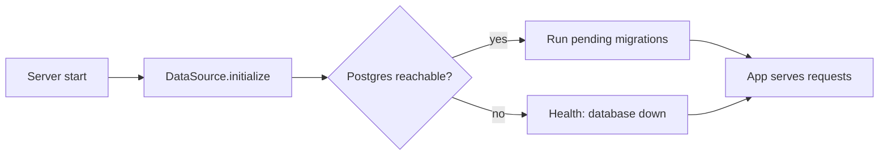

# Database migrations (TypeORM)

All PostgreSQL schema changes in this project go through **TypeORM migrations**. The app does not use `synchronize: true`, so tables are never auto-created or altered at runtime except via migration files.

## Principles

| Rule | Detail |
|------|--------|
| Migrations only | Every table, column, index, or constraint change is a committed migration file |
| No auto-sync | `synchronize: false` in [`backend/src/database/database.config.ts`](../../backend/src/database/database.config.ts) |
| Manual authoring | Create empty migrations with `migration:create`, then write `up` / `down` yourself |
| Auto-run on start | Pending migrations run when the server connects to Postgres (`migrationsRun: true`) |
| History table | Applied migrations are recorded in `typeorm_migrations` |

## Layout

```
backend/src/database/
  database.config.ts    # Shared TypeORM options (entities, migrations, migrationsRun)
  database.module.ts    # Nest DataSource provider; calls initialize() on boot
  data-source.ts        # CLI entry point (loads .env via dotenv)
  migrations/           # One .ts file per migration (commit these)
    *.ts

backend/src/**/*.entity.ts   # TypeORM entities (discovered automatically)
```

After `npm run build`, compiled migrations live under `dist/database/migrations/*.js` and are picked up in production the same way.

## Prerequisites

1. PostgreSQL running and reachable from the backend.
2. [`backend/.env`](../../backend/.env) configured (copy from [`.env.example`](../../backend/.env.example)):

   | Variable | Purpose |
   |----------|---------|
   | `DB_HOST` | Postgres host |
   | `DB_PORT` | Postgres port |
   | `DB_NAME` | Database name |
   | `DB_USER` | Username |
   | `DB_PASSWORD` | Password |

3. Run CLI commands from the **`backend/`** directory.

## npm scripts

All commands assume `backend/.env` is present (CLI loads it via `data-source.ts`).

| Command | Purpose |
|---------|---------|
| `npm run migration:create -- src/database/migrations/DescriptiveName` | Create a new empty migration file |
| `npm run migration:run` | Apply pending migrations without starting Nest |
| `npm run migration:revert` | Undo the last applied migration |
| `npm run migration:show` | List migrations and whether they have run |
| `npm run typeorm` | Low-level TypeORM CLI (same `-d` data source) |

## Workflow: add or change schema

### 1. Add or update an entity (optional but recommended)

Place entities anywhere under `src/` using the `*.entity.ts` suffix, for example:

`backend/src/tasks/task.entity.ts`

Entities are loaded from:

`src/**/*.entity.{ts,js}` (dev) / `dist/**/*.entity.js` (production)

### 2. Create a migration

```bash
cd backend
npm run migration:create -- src/database/migrations/AddTasksTable
```

This creates a timestamped file under `src/database/migrations/`. **Edit that file** — the generator only scaffolds empty `up` / `down` methods.

### 3. Implement `up` and `down`

Example:

```typescript
import { MigrationInterface, QueryRunner } from 'typeorm';

export class AddTasksTable1740000000000 implements MigrationInterface {
  name = 'AddTasksTable1740000000000';

  public async up(queryRunner: QueryRunner): Promise<void> {
    await queryRunner.query(`
      CREATE TABLE "tasks" (
        "id" uuid NOT NULL DEFAULT gen_random_uuid(),
        "title" character varying NOT NULL,
        "completed" boolean NOT NULL DEFAULT false,
        "created_at" TIMESTAMP NOT NULL DEFAULT now(),
        CONSTRAINT "PK_tasks" PRIMARY KEY ("id")
      )
    `);
  }

  public async down(queryRunner: QueryRunner): Promise<void> {
    await queryRunner.query(`DROP TABLE "tasks"`);
  }
}
```

- **`up`**: apply the change (forward).
- **`down`**: reverse the change (for local rollback via `migration:revert`).

Keep migrations **small and focused** (one logical change per file when possible).

### 4. Apply the migration

**Option A — start the server** (default):

```bash
npm run start:dev
```

On successful DB connection, `initialize()` runs any pending migrations.

**Option B — CLI only**:

```bash
npm run migration:run
```

### 5. Commit

Commit both the migration file and any new/updated entity files. Deployed builds run pending migrations on the next server start.

## How it works at runtime



- Config: [`getDatabaseConfig()`](../../backend/src/database/database.config.ts) sets `migrationsRun: true` and `migrationsTableName: 'typeorm_migrations'`.
- Bootstrap: [`createDataSource()`](../../backend/src/database/database.module.ts) calls `initialize()`, which applies migrations when the database is up.
- If Postgres is down, initialization fails gracefully; the app still boots and `/health` reports `database: "down"`.

## Docker and production

- The [backend Dockerfile](../../backend/Dockerfile) does not need a separate migration step: `nest build` compiles migrations into `dist/`, and startup runs them via `migrationsRun`.
- Ensure Postgres is available before or when the backend container starts if you expect migrations to succeed on first boot.
- Pass the same `DB_*` variables into the container (e.g. `--env-file backend/.env`).

## Checking migration status

```bash
cd backend
npm run migration:show
```

Shows which migration files exist and which are recorded in `typeorm_migrations`.

## Reverting a migration (local dev)

```bash
npm run migration:revert
```

Runs the `down` method of the most recently applied migration. Use with care on shared or production databases.

## Optional: generate from entity diff

Once entities exist and the database reflects the previous migration state, you can generate a migration from the diff:

```bash
npm run typeorm -- migration:generate src/database/migrations/DescribeChange
```

Review the generated SQL carefully before committing. This project’s default workflow is **manual** `migration:create`; generate is optional.

## Do not

- Turn on `synchronize: true` for convenience.
- Apply schema changes only in pgAdmin/SQL without a matching migration file.
- Edit a migration that has already been applied on a shared environment — add a new migration instead.

## Troubleshooting

| Symptom | Likely cause | What to do |
|---------|----------------|------------|
| `migration:show` hangs or times out | Postgres not running or wrong `DB_*` in `.env` | Start Postgres; verify host/port/credentials |
| `The system cannot find the path specified` (Windows) | `typeorm-ts-node-commonjs` shim calls `/bin/sh` | Use the project `npm run migration:*` scripts (they invoke `node -r ts-node/register` directly) |
| `inconsistent types deduced for parameter $1` | Reused `$n` in INSERT…SELECT without casts | Cast parameters (e.g. `$1::varchar`) to match column types |
| Migration fails on startup | SQL error in `up`, or DB already partially changed | Fix migration or DB state; use `migration:revert` locally if safe |
| `relation already exists` | Table created outside migrations | Add a baseline migration or align DB manually, then migrate forward |
| No migrations run | Empty `migrations/` folder | Expected until the first migration is added |
| CLI can’t find config | Wrong working directory | Run commands from `backend/` |

## Related files

- [`backend/src/database/database.config.ts`](../../backend/src/database/database.config.ts)
- [`backend/src/database/data-source.ts`](../../backend/src/database/data-source.ts)
- [`backend/src/database/database.module.ts`](../../backend/src/database/database.module.ts)
- [`backend/.env.example`](../../backend/.env.example)
